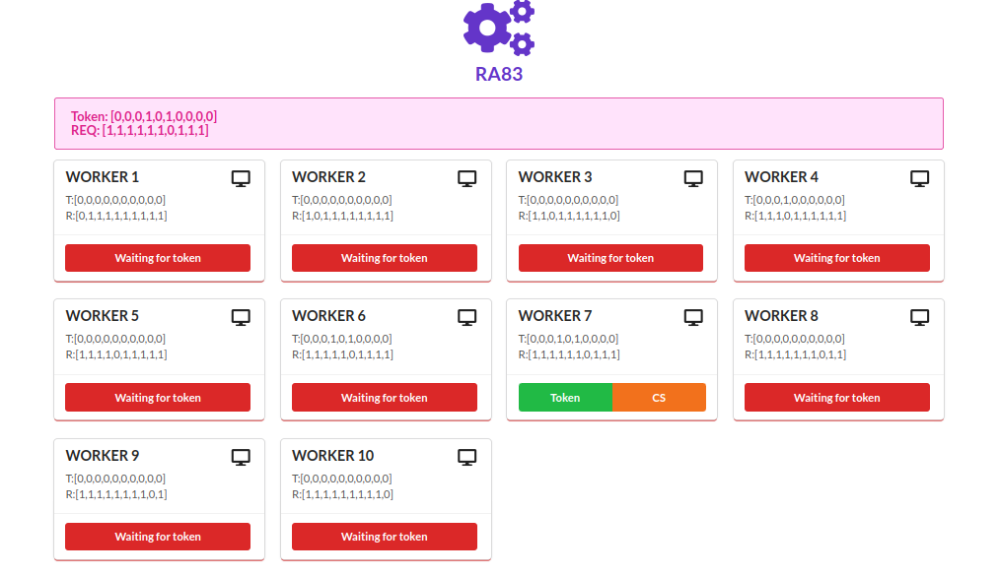

# Ricart and Agrawala 1983 (RA83) SIMULATION
## About
A simulation of RA83 with 10 containers (running a simple django server) as 10 nodes, and a watchdog server to watch the evolution of the algorithm.
## Requirements
* Docker
* Django
* Django Channels
* Redis
## Getting Started
1. Build the 'ra83-server' image using dockerfile 'RA83D/Dockerfile'
    ```sh
    docker build --rm -t ra83-server:latest RA83D/.
   ```
2. in /ra83_watchdog : migrate and create a superuser
    ```sh
    python manage.py migrate
    python manage.py createsuperuser
    ```
3. Install Redis and start redis-server
4. Run the Django server 'ra83_watchdog' on port 8000:
    ```sh
    python manage.py runserver 0.0.0.0:8000
    ```

5. create 10 worker instances using django admin
6. Deploy the containers: run 'RA83D/start_servers.py'
    ```sh
    python RA83D/start_servers.py
    ```
7. visit http://localhost:8000 :
   